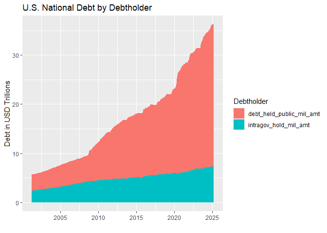
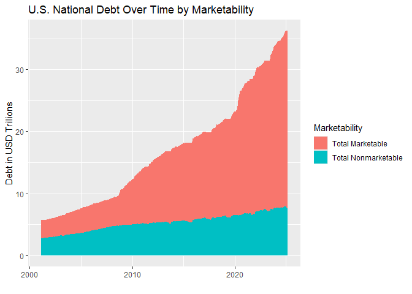
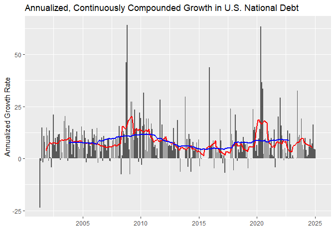

U.S. National Debt Over Time
================
Last updated: 2024-01-09

## Preliminary Work: Install/Load Packages

The first, preliminary step is to load in all the necessary packages
that we will need. The first three lines of this code chunk check if
these packages have been installed yet, installs them if necessary, and
then loads these packages into our R session.

- The `httr` package lets us easily make the API calls for the data.
- The `jsonlite` package helps us read the JSON API response and
  transform it to R data.
- The `tidyr` package provides tools for working with the data.
- The `ggplot2` package lets us generate nice graphics to visualize the
  data.
- The `zoo` package contains the `rollmean()` function that is used in
  some visualizations.

``` r
# Create list of packages needed for this exercise
list.of.packages <- c("httr", "jsonlite","tidyr","ggplot2","zoo","rmarkdown")
# Check if any have not yet been installed
new.packages <- list.of.packages[!(list.of.packages %in% installed.packages()[,"Package"])]
# If any need to be installed, install them
if(length(new.packages)) install.packages(new.packages)
# Load in the packages
library(httr)
library(jsonlite)
library(tidyr)
library(ggplot2)
library(zoo)
```

    ## 
    ## Attaching package: 'zoo'

    ## The following objects are masked from 'package:base':
    ## 
    ##     as.Date, as.Date.numeric

## Example API Request

Before requesting the full series of the national debt, we will
replicate the example API request from
<https://fiscaldata.treasury.gov/datasets/monthly-statement-public-debt/>.
For this example, we will break this process down into tiny pieces to
explore the steps in the process.

First, we will specify the base url for the fiscal data API.

``` r
#urlbase = "https://transparency.treasury.gov/services/api/fiscal_service"
urlbase = "https://api.fiscaldata.treasury.gov/services/api/fiscal_service"
```

Then, we add the endpoint for the “Summary of Treasury Securities
Outstanding” table. The `paste()` function allows for us to concatenate
the two strings to create the full url. The `sep=` option allows for
inserting text between the strings being concatenated, which we do not
want here. Thus, we enter an empty string as the separator.

``` r
urlend = "v1/debt/mspd/mspd_table_1"
urlfull = paste(urlbase,urlend,sep="/")
urlfull
```

    ## [1] "https://api.fiscaldata.treasury.gov/services/api/fiscal_service/v1/debt/mspd/mspd_table_1"

After we create the full url string for the table that we want, the next
step is to specify any parameters for the API call, which effectively
convey additional instructions for what data we want and how we want it
returned. For this example, we want to (1) sort the data by date
(`record_date`), (2) specify a JSON response, and (3) retrieve only the
first observation after the sorting.

The `-` before `record_date` in the first parameter sorts the dates in
descending order so that the most recent observation is at the top. The
JSON format option is actually unnecessary as it is the default response
format, but if we wanted to receive csv or xml formatted response, we
would specify that here. For requesting only the first observation, this
consists of two parts: `page[size]` specifies how any observations in
each response and `page[number]` specifies which ‘page’ to request (if
we wanted the second observation, then we would keep `page[size]` as is
and switch to `page[number]=2`). Note: the first parameter is indicated
by `?` and each subsequent parameter is separated with an `&`.

``` r
opt1 = "?sort=-record_date"
opt2 = "&format=json"
opt3 = "&page[number]=1&page[size]=1"
request1 = paste(urlfull,opt1,opt2,opt3,sep='')
request1
```

    ## [1] "https://api.fiscaldata.treasury.gov/services/api/fiscal_service/v1/debt/mspd/mspd_table_1?sort=-record_date&format=json&page[number]=1&page[size]=1"

Now we can request the raw data from the API using the `GET()` function.

``` r
response1 = GET(request1)
response1
```

    ## Response [https://api.fiscaldata.treasury.gov/services/api/fiscal_service/v1/debt/mspd/mspd_table_1?sort=-record_date&format=json&page[number]=1&page[size]=1]
    ##   Date: 2024-01-09 22:11
    ##   Status: 200
    ##   Content-Type: application/json
    ##   Size: 2.1 kB

Since the content is returned in raw bytes, we must convert this to
text, which will output the JSON response as a character array (we can
also use `rawToChar(response1$content)`, which will do the same thing).

``` r
jsonresponse1 = content(response1,"text")
```

    ## No encoding supplied: defaulting to UTF-8.

``` r
jsonresponse1
```

    ## [1] "{\"data\":[{\"record_date\":\"2023-12-31\",\"security_type_desc\":\"Marketable\",\"security_class_desc\":\"Bills\",\"debt_held_public_mil_amt\":\"5674825.4005\",\"intragov_hold_mil_amt\":\"955.663\",\"total_mil_amt\":\"5675781.0635\",\"src_line_nbr\":\"1\",\"record_fiscal_year\":\"2024\",\"record_fiscal_quarter\":\"1\",\"record_calendar_year\":\"2023\",\"record_calendar_quarter\":\"4\",\"record_calendar_month\":\"12\",\"record_calendar_day\":\"31\"}],\"meta\":{\"count\":1,\"labels\":{\"record_date\":\"Record Date\",\"security_type_desc\":\"Security Type Description\",\"security_class_desc\":\"Security Class Description\",\"debt_held_public_mil_amt\":\"Debt Held by the Public (in Millions)\",\"intragov_hold_mil_amt\":\"Intragovernmental Holdings (in Millions)\",\"total_mil_amt\":\"Total Public Debt Outstanding (in Millions)\",\"src_line_nbr\":\"Source Line Number\",\"record_fiscal_year\":\"Fiscal Year\",\"record_fiscal_quarter\":\"Fiscal Quarter Number\",\"record_calendar_year\":\"Calendar Year\",\"record_calendar_quarter\":\"Calendar Quarter Number\",\"record_calendar_month\":\"Calendar Month Number\",\"record_calendar_day\":\"Calendar Day Number\"},\"dataTypes\":{\"record_date\":\"DATE\",\"security_type_desc\":\"STRING\",\"security_class_desc\":\"STRING\",\"debt_held_public_mil_amt\":\"CURRENCY\",\"intragov_hold_mil_amt\":\"CURRENCY\",\"total_mil_amt\":\"CURRENCY\",\"src_line_nbr\":\"INTEGER\",\"record_fiscal_year\":\"YEAR\",\"record_fiscal_quarter\":\"QUARTER\",\"record_calendar_year\":\"YEAR\",\"record_calendar_quarter\":\"QUARTER\",\"record_calendar_month\":\"MONTH\",\"record_calendar_day\":\"DAY\"},\"dataFormats\":{\"record_date\":\"YYYY-MM-DD\",\"security_type_desc\":\"String\",\"security_class_desc\":\"String\",\"debt_held_public_mil_amt\":\"$10.20\",\"intragov_hold_mil_amt\":\"$10.20\",\"total_mil_amt\":\"$10.20\",\"src_line_nbr\":\"10\",\"record_fiscal_year\":\"YYYY\",\"record_fiscal_quarter\":\"Q\",\"record_calendar_year\":\"YYYY\",\"record_calendar_quarter\":\"Q\",\"record_calendar_month\":\"MM\",\"record_calendar_day\":\"DD\"},\"total-count\":4211,\"total-pages\":4211},\"links\":{\"self\":\"&page%5Bnumber%5D=1&page%5Bsize%5D=1\",\"first\":\"&page%5Bnumber%5D=1&page%5Bsize%5D=1\",\"prev\":null,\"next\":\"&page%5Bnumber%5D=2&page%5Bsize%5D=1\",\"last\":\"&page%5Bnumber%5D=4211&page%5Bsize%5D=1\"}}"

Then, to convert this JSON response to something workable in R, we use
the `fromJSON()` function to convert the response to an R data frame,
which is the data variable in the converted response. Note: use `$` to
specify a variable within a data frame.

``` r
dfresponse1 = fromJSON(jsonresponse1)
myData1 = dfresponse1$data
myData1
```

    ##   record_date security_type_desc security_class_desc debt_held_public_mil_amt
    ## 1  2023-12-31         Marketable               Bills             5674825.4005
    ##   intragov_hold_mil_amt total_mil_amt src_line_nbr record_fiscal_year
    ## 1               955.663  5675781.0635            1               2024
    ##   record_fiscal_quarter record_calendar_year record_calendar_quarter
    ## 1                     1                 2023                       4
    ##   record_calendar_month record_calendar_day
    ## 1                    12                  31

**Alternatively, we can simply use the `fromJSON()` function on
`request1`, which will cut out the intermediate steps (note: `myData1`
and `myData` are identical).**

``` r
dfresponse = fromJSON(request1)
myData = dfresponse$data
myData
```

    ##   record_date security_type_desc security_class_desc debt_held_public_mil_amt
    ## 1  2023-12-31         Marketable               Bills             5674825.4005
    ##   intragov_hold_mil_amt total_mil_amt src_line_nbr record_fiscal_year
    ## 1               955.663  5675781.0635            1               2024
    ##   record_fiscal_quarter record_calendar_year record_calendar_quarter
    ## 1                     1                 2023                       4
    ##   record_calendar_month record_calendar_day
    ## 1                    12                  31

Now that we have this more efficient way of loading the data into R, we
need to make sure that the variables are formatted correctly. If we use
the `class()` function to examine a few variable formats, we see that
everything is formatted as a character array.

``` r
class(myData$record_date)
```

    ## [1] "character"

``` r
class(myData$security_type_desc)
```

    ## [1] "character"

``` r
class(myData$debt_held_public_mil_amt)
```

    ## [1] "character"

``` r
myData$debt_held_public_mil_amt/2
```

    ## Error in myData$debt_held_public_mil_amt/2: non-numeric argument to binary operator

To reformat any non-text variables, we can use the `as()` functions. For
this example, we will just format one date and one numeric variable to
demonstrate the process.

``` r
myData$record_date = as.Date(myData$record_date)
class(myData$record_date)
```

    ## [1] "Date"

``` r
myData$debt_held_public_mil_amt = as.numeric(myData$debt_held_public_mil_amt)
class(myData$debt_held_public_mil_amt)
```

    ## [1] "numeric"

``` r
myData$debt_held_public_mil_amt/2
```

    ## [1] 2837413

## Full API Request

Now that we have worked through the example API request, let’s move on
to our project’s goal of importing the full series of national debt
observations.

First, we need to adjust our parameters to reflect this new request. We
will reuse `opt1` from `request1` to sort the observations. The next
parameter specifies the variables that we want (the last seven variables
are mostly redundant so we omit them). The third parameter specifies
that we want all of the observations returned in this request (we do
this by specifying a large number for `page[size]`).

``` r
req2opt1 = opt1
req2opt2 = "&fields=record_date,security_type_desc,security_class_desc,debt_held_public_mil_amt,intragov_hold_mil_amt,total_mil_amt"
req2opt3 = "&page[size]=10000"
request2 = paste(urlfull,req2opt1,req2opt2,req2opt3,sep="")
```

Now make the request and save the response as a data frame using
`fromJSON()`.

``` r
dfresponse2 = fromJSON(request2)
```

Next, extract the data frame and format the variables. Lastly, print the
first 20 observations of the data frame to get a better feel for the
layout.

``` r
debtdf = dfresponse2$data
# Format datetime variables
debtdf$record_date = as.Date(debtdf$record_date)
# Format numeric variables
debtdf$debt_held_public_mil_amt = as.numeric(debtdf$debt_held_public_mil_amt)
debtdf$intragov_hold_mil_amt = as.numeric(debtdf$intragov_hold_mil_amt)
debtdf$total_mil_amt = as.numeric(debtdf$total_mil_amt)
head(debtdf,20)
```

    ##    record_date            security_type_desc
    ## 1   2023-12-31                    Marketable
    ## 2   2023-12-31                    Marketable
    ## 3   2023-12-31                    Marketable
    ## 4   2023-12-31                    Marketable
    ## 5   2023-12-31                    Marketable
    ## 6   2023-12-31                    Marketable
    ## 7   2023-12-31              Total Marketable
    ## 8   2023-12-31                 Nonmarketable
    ## 9   2023-12-31                 Nonmarketable
    ## 10  2023-12-31                 Nonmarketable
    ## 11  2023-12-31                 Nonmarketable
    ## 12  2023-12-31                 Nonmarketable
    ## 13  2023-12-31           Total Nonmarketable
    ## 14  2023-12-31 Total Public Debt Outstanding
    ## 15  2023-11-30                    Marketable
    ## 16  2023-11-30                    Marketable
    ## 17  2023-11-30                    Marketable
    ## 18  2023-11-30                    Marketable
    ## 19  2023-11-30                    Marketable
    ## 20  2023-11-30                    Marketable
    ##                        security_class_desc debt_held_public_mil_amt
    ## 1                                    Bills               5674825.40
    ## 2                                    Notes              13753526.47
    ## 3                                    Bonds               4347388.19
    ## 4  Treasury Inflation-Protected Securities               2005719.21
    ## 5                      Floating Rate Notes                571425.24
    ## 6                   Federal Financing Bank                     0.00
    ## 7                                        _              26352884.51
    ## 8                          Domestic Series                 17292.84
    ## 9        State and Local Government Series                 91536.42
    ## 10        United States Savings Securities                171963.65
    ## 11               Government Account Series                300580.62
    ## 12                                   Other                  4259.51
    ## 13                                       _                585633.03
    ## 14                                       _              26938517.54
    ## 15                                   Bills               5670154.83
    ## 16                                   Notes              13724679.06
    ## 17                                   Bonds               4326514.89
    ## 18 Treasury Inflation-Protected Securities               1985764.49
    ## 19                     Floating Rate Notes                545426.42
    ## 20                  Federal Financing Bank                     0.00
    ##    intragov_hold_mil_amt total_mil_amt
    ## 1               955.6630   5675781.064
    ## 2              4678.3695  13758204.841
    ## 3              7164.7746   4354552.964
    ## 4               504.8921   2006224.104
    ## 5                27.3800    571452.618
    ## 6              5492.2060      5492.206
    ## 7             18823.2852  26371707.797
    ## 8                 0.0000     17292.835
    ## 9                 0.0000     91536.420
    ## 10                0.0000    171963.645
    ## 11          7044152.7557   7344733.377
    ## 12                0.0000      4259.510
    ## 13          7044152.7557   7629785.787
    ## 14          7062976.0409  34001493.584
    ## 15              994.3880   5671149.218
    ## 16             4931.5021  13729610.566
    ## 17             7050.5346   4333565.422
    ## 18              891.6254   1986656.112
    ## 19               26.0100    545452.435
    ## 20             5492.2060      5492.206

To make our figures a little cleaner later, we will also create a new
variable that converts the units of the national debt into trillions of
\$USD, rather than millions.

``` r
debtdf$total_tril_amt = debtdf$total_mil_amt/1000000
```

Since the table contains observations for the total national debt along
with various subsets, we need to extract the subset of observations
corresponding with total debt figures. As with many things in R, there
are multiple ways to do this. Two examples the yield identical results
are:

``` r
totaldebtdf = debtdf[which(debtdf$security_type_desc=="Total Public Debt Outstanding"),]
totaldebtdf2 = subset(debtdf,security_type_desc=="Total Public Debt Outstanding",)
```

Now our data frame consists of more than 200 monthly observations of the
total national debt beginning in 01/2002. Since we have automated this
using the API, every time we run this code, it will automatically fetch
the most recent observations. We can also see the breakdown between debt
held by the public and debt held by governmental agencies respectively
with the columns labelled `debt_held_public_mil_amt` and
`intragov_hold_mil_amt`.

``` r
head(totaldebtdf,10)
```

    ##     record_date            security_type_desc security_class_desc
    ## 14   2023-12-31 Total Public Debt Outstanding                   _
    ## 28   2023-11-30 Total Public Debt Outstanding                   _
    ## 42   2023-10-31 Total Public Debt Outstanding                   _
    ## 56   2023-09-30 Total Public Debt Outstanding                   _
    ## 70   2023-08-31 Total Public Debt Outstanding                   _
    ## 84   2023-07-31 Total Public Debt Outstanding                   _
    ## 98   2023-06-30 Total Public Debt Outstanding                   _
    ## 112  2023-05-31 Total Public Debt Outstanding                   _
    ## 126  2023-04-30 Total Public Debt Outstanding                   _
    ## 141  2023-03-31 Total Public Debt Outstanding                   _
    ##     debt_held_public_mil_amt intragov_hold_mil_amt total_mil_amt total_tril_amt
    ## 14                  26938518               7062976      34001494       34.00149
    ## 28                  26843822               7034857      33878679       33.87868
    ## 42                  26576222               7123358      33699580       33.69958
    ## 56                  26330142               6837192      33167334       33.16733
    ## 70                  26044051               6870099      32914149       32.91415
    ## 84                  25708799               6899786      32608585       32.60859
    ## 98                  25461998               6870276      32332274       32.33227
    ## 112                 24630686               6833771      31464457       31.46446
    ## 126                 24605068               6852747      31457815       31.45782
    ## 141                 24693515               6764923      31458438       31.45844

## Plotting the Data

### Simple Line Chart

To plot out the national debt over time, we will first use the standard
`plot()` function, and a few options to set some labels, which creates a
simple line chart plotting the time series.

``` r
plot(totaldebtdf$record_date,totaldebtdf$total_tril_amt,type='l',main="U.S. National Debt Over Time",xlab="",ylab="Debt in USD Trillions") 
```

<!-- -->

However, the `ggplot2` package provides lots of extra visualization
functionality that can make the plotting process a bit smoother and more
capable. Let’s replicate the above figure using `ggplot()` to see the
differences.

``` r
ggplot(totaldebtdf,aes(x=record_date,y=total_tril_amt)) + 
  geom_line() +
  ggtitle("U.S. National Debt over Time") +
  xlab("") +
  ylab("Debt in USD Trillions")
```

<!-- -->

### Stacked Line Chart 1: Publicly Held Debt vs. Intragovernmental Holdings

A good way to visually dive deeper into the data is to decompose the
debt into different categories based on the groupings provided. The
first partition we can make is by debt holder. A portion of the national
debt exists as a liability for one governmental agency and an asset for
another agency (hence, intragovernmental holdings).

To compare across publicly held debt and intragovernmental holdings, we
must first combine the two variables together using the `gather()`
function (ggplot2 tends to prefer long panels, rather than wide panels
of data), convert the values to trillions, and then plot the stacked
area chart using `ggplot()` along with a few labeling options.

``` r
# Extract relevant variables from totaldebtdf
helddf = totaldebtdf[,c("record_date","debt_held_public_mil_amt","intragov_hold_mil_amt")]
# Combine the two `mil_amt` variables into one and create a new variable `Holder` that indicates which observations belong to which category.
helddf = gather(helddf,"Holder","mil_amt",-record_date)
# Convert millions to trillions
helddf$tril_amt = helddf$mil_amt/1000000
# Plot stacked line chart
ggplot(helddf, aes(x=record_date, y=tril_amt, fill=Holder)) +
  geom_area(position='stack') +
  xlab("") +
  ylab("Debt in USD Trillions") +
  labs(title="U.S. National Debt by Debtholder",fill="Debtholder")
```

<!-- -->

This shows that the intragovernmental holdings have tended to be more
stable in their growth, whereas the publicly held debt has grown more
rapidly over the past decade plus.

### Stacked Line Chart 2: Debt by Marketability

Another way to partition the data is by debt marketability, which is
indicated by the `security_type_desc` variable in `debtdf`. This
variable already is in a long panel format, so all we need to do is
remove all the extra observations for the further subsets and
aggregates. Practically, this is effectively the same partition as the
previous debt holder split. So the main point for this is how one might
plot such a stacked line chart when the group labels are in a single,
categorical variable, rather than separate variables.

``` r
# Extract relevant observations from debtdf (only need subtotals for marketable and nonmarketable debt)
stackdf = subset(debtdf,security_type_desc%in%c("Total Marketable","Total Nonmarketable"),)
# Plot stacked line chart (no extra steps since categories are already in correct vertical format)
ggplot(stackdf, aes(x=record_date, y=total_tril_amt, fill=security_type_desc)) +
  geom_area(position = 'stack') +
  xlab("") +
  ylab("Debt in USD Trillions") +
  labs(title="U.S. National Debt Over Time by Marketability",fill="Marketability")
```

<!-- -->

### Stacked Line Chart 3: Debt by Security Class

Lastly, we can make use of all the smallest subsets to show a more
detailed breakdown of the debt. However, due to the fairly large number
of categories, the most optimal way to present this data likely would
involve aggregating similar categories to maybe 4-5 groups.

``` r
# Extract relevant observations (remove subtotals and totals; keep only the individual security classes)
secclassdf = subset(debtdf,security_class_desc!="_")
# Plot the stacked line chart
ggplot(secclassdf, aes(x=record_date, y=total_tril_amt, fill=security_class_desc)) +
  geom_area(position = 'stack') +
  xlab("") +
  ylab("Debt in USD Trillions") +
  labs(title="U.S. National Debt by Security Class",fill="Security Class")
```

<!-- -->

### Histogram: Continuously Compounded Growth

As the final exercise in this demonstration, we will convert the monthly
levels of the national debt into annualized growth measurements, which
generally is the more appropriate format for analyzing financial data
such as this. The rationale is a bit more statistically nuanced (see
[Stationarity](https://www.r-econometrics.com/timeseries/stationarity/)
and
[Unit](https://medium.com/codex/unit-root-in-time-series-38d451d742ce)
[Roots](https://www.mathworks.com/help/econ/unit-root-nonstationarity.html)),
but the general idea is that these ‘log returns’ better approximated by
the normal distribution than the ‘levels’ or ‘prices’ of financial
variables. Thus, statistical inferences that rely on the assumption of
normality are more appropriate when modelling stock returns, rather than
stock prices.

The code chunk below combines a couple steps. The first thing to note is
that when converting to rates of growth, we lose one observation of
time. This is due to not having a previous (lag) value to compare the
earliest observation to. Thus, we insert an `NA` to fill the lost
observation with a missing value (the `c()` function combines two
vectors into one). Then the differences in the natural logarithms of the
national debt are taken, which effectively shifts units from levels to
growth rates. Then lastly, we annualize the monthly growth rates by
multiplying by 12, and convert to percentage units by multiplying by
100.

``` r
totaldebtdf$annpct = c(-diff(log(totaldebtdf$total_tril_amt)),NA)*12*100
```

To visualize the historical growth rates, we plot each month’s
annualized growth rate using bars `geom_col()`. This shows a fair amount
of variation from month to month. To see a more informative trend over
time, we also plot the rolling averages for windows of 12 months (red)
and 60 months (blue). As can be seen in the figure, the larger the
rolling window, the smoother the trend becomes.

``` r
ggplot(totaldebtdf,aes(x=record_date, y=annpct))+
  geom_col()+
  geom_line(aes(y=rollmean(annpct, 12, na.pad=TRUE)), colour="red", linewidth=1) +
  geom_line(aes(y=rollmean(annpct, 60, na.pad=TRUE)), colour="blue", linewidth=1) +
  ggtitle("Annualized, Continuously Compounded Growth in U.S. National Debt") +
  xlab("") +
  ylab("Annualized Growth Rate")
```

    ## Warning: Removed 1 rows containing missing values (`position_stack()`).

    ## Warning: Removed 12 rows containing missing values (`geom_line()`).

    ## Warning: Removed 60 rows containing missing values (`geom_line()`).

<!-- -->

Then to hammer home the point regarding statistical normality. Let’s
plot the frequency histograms for each the national debt levels, logs,
and growth rates. In addition to the histograms, the red lines plot a
normal
([Gaussian](https://mathworld.wolfram.com/NormalDistribution.html)) bell
curve constructed from the empirical means and standard deviations. The
levels histogram is shows a very non-normal shape for the data. Then
after taking the natural logarithm of the debt levels, this appears to
center the fitted bell curve. Then, after differencing the logs to get
growth rates, that histogram leads to an even better fitting bell curve
to represent the return distribution. Interestingly, there are several
outliers on the positive growth side, and only one outlier in the
negative direction. That one negative outlier corresponds to the very
first observation in the dataset, April 2001.

``` r
# Set desired binwidth and number of non-missing obs
bw = 1
n_obs = sum(!is.na(totaldebtdf$annpct))

ggplot(totaldebtdf,aes(total_tril_amt)) +
  geom_histogram(binwidth=bw) +
  stat_function(fun=function(x) dnorm(x, mean=mean(totaldebtdf$annpct, na.rm=TRUE),   sd=sd(totaldebtdf$annpct, na.rm=TRUE)) * n_obs * bw, color = "darkred", linewidth = 1) +
  xlab("Total Debt (in USD Trillions)") +
  ylab("Frequency")
```

<!-- -->

``` r
ggplot(totaldebtdf,aes(log(total_tril_amt))) +
  geom_histogram(binwidth=0.1) +
  stat_function(fun=function(x) dnorm(x, mean=mean(log(totaldebtdf$total_tril_amt), na.rm=TRUE),   sd=sd(log(totaldebtdf$total_tril_amt), na.rm=TRUE)) * n_obs * 0.1, color = "darkred", linewidth = 1) +
  xlab("Total Debt (in Log USD Trillions)") +
  ylab("Frequency")
```

<!-- -->

``` r
ggplot(totaldebtdf,aes(annpct)) +
  geom_histogram(binwidth=bw) +
  stat_function(fun=function(x) dnorm(x, mean=mean(totaldebtdf$annpct, na.rm=TRUE),   sd=sd(totaldebtdf$annpct, na.rm=TRUE)) * n_obs * bw, color = "darkred", linewidth = 1) +
  xlab("Annualized Growth Rates") +
  ylab("Frequency")
```

    ## Warning: Removed 1 rows containing non-finite values (`stat_bin()`).

<!-- -->

## Summary Statistics

Lastly, let’s compute some summary statistics of the annualized growth
rates to relate some numbers to the fitted bell curve above, which is
defined by the mean and standard deviation. Additionally, the
`summary()` function also provides the quartiles of the empirical
distribution.

``` r
mean(totaldebtdf$annpct, na.rm=TRUE) |> round(2)
```

    ## [1] 7.79

``` r
sd(totaldebtdf$annpct, na.rm=TRUE) |> round(2)
```

    ## [1] 9.79

``` r
summary(totaldebtdf$annpct) |> round(2)
```

    ##    Min. 1st Qu.  Median    Mean 3rd Qu.    Max.    NA's 
    ##  -23.59    0.58    6.70    7.79   11.19   64.02       1
