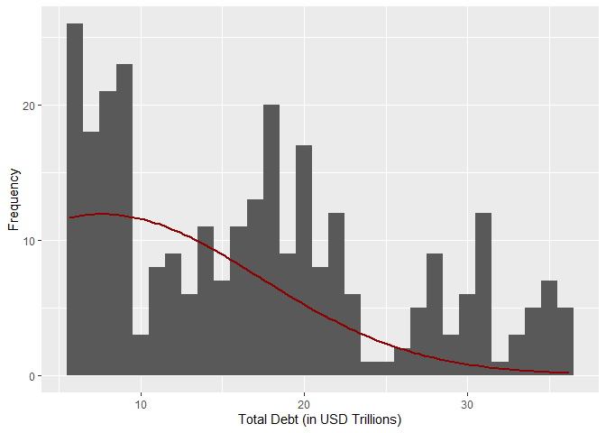

U.S. National Debt Over Time
================
Last updated: 2025-03-30

## Preliminary Work: Install/Load Packages

To try and ensure that this R Notebook will run successfully, we’ll use
the [renv
package](https://cran.r-project.org/web/packages/renv/index.html) to
create a project-specific library of packages. This will allow us to
install the packages that we need for this project without affecting any
other projects that we may be working on. Additionally, the project
library will track the specific versions of the dependency packages so
that any updates to those packages will not break this project.

The code chunk below will first install the renv package if it is not
already installed. Then we will load the package. Next, we’ll use the
`restore()` function to install any packages listed in the renv.lock
file. Once these packages are installed, we can load them into the R
session using the `library()` commands. Below the code chunk, we’ll list
out the packages that will be used in the project demo. And if you run
into any trouble using renv, then you can use the second code chunk
below and that should be an even more reliable approach to install the
required packages.

``` r
# Install renv package if not already installed
if(!"renv" %in% installed.packages()[,"Package"]) install.packages("renv")
# Load renv package
library(renv)
# Use restore() to install any packages listed in the renv.lock file
renv::restore(clean=TRUE, lockfile="../renv.lock")
# Load in the packages
library(httr2)
library(httpuv)
library(jsonlite)
library(tidyr)
library(ggplot2)
library(zoo)
```

- The [httr2 package](https://cran.r-project.org/package=httr2) lets us
  easily make the API calls for the data.
  - The original version of this demo used the httr package to perform
    the Example API Request and was updated in January 2024 to make use
    of the httr2 package. See the [httr2
    announcement](https://www.tidyverse.org/blog/2023/11/httr2-1-0-0/)
    from November 2023 for more details about this update.
- The [httpuv package](https://cran.r-project.org/package=httpuv) is
  used by httr2 to perform the [HTTP
  requests](https://search.brave.com/search?q=HTTP).
- The [jsonlite package](https://cran.r-project.org/package=jsonlite)
  helps us read the JSON API response and transform it to R data.
- The [tidyr package](https://cran.r-project.org/package=tidyr) provides
  tools for working with the data.
- The [ggplot2 package](https://cran.r-project.org/package=ggplot2) lets
  us generate nice graphics to visualize the data.
- The [zoo package](https://cran.r-project.org/package=zoo) contains the
  `rollmean()` function that is used in some visualizations.
- The [rmarkdown package](https://cran.r-project.org/package=rmarkdown)
  is used to generate this R Notebook into html.

Since the rmarkdown functionality is built into RStudio, this last one
is automatically loaded when you open RStudio. So no need to use the
`library()` function for it. Another observation to make about the code
chunk above is that it is labeled as `setup`, which is a special name,
which the R Notebook will recognize and automatically run prior to
running any other code chunk. This is useful for loading in packages and
setting up other global options that will be used throughout the
notebook.

Then if you wish to try and update the versions of the various R
packages in the lock file, you can use the `renv::update()` function to
update the packages in the project library. However, it is possible that
these updates could break the code in this notebook. If so, you may need
to adapt the code to work with the updated packages.

My recommendation is to first run through the code using the versions of
the packages in the lock file. Then if you want to try and update the
packages, you can do so and then run through the code again to see if it
still works. If not, you can always revert back to the lock file
versions using the `renv::restore()` function.

If you update the packages and get everything working successfully, then
you can update the lock file using the `renv::snapshot()` function. This
will update the lock file with the versions of the packages that are
currently installed in the project library. Then you can commit the
updated lock file to the repository so that others can use the updated
versions of the packages.

### Alternative Package Installation Code

If you run into any trouble using renv in the code chunk above, then you
can use the code chunk below to install the required packages for this
analysis. This method will first check if you have already installed the
packages. If any are missing, it will then install them. Then it will
load the packages into the R session. A potential flaw in this approach
compared to using renv is that it will simply install the latest
versions of the packages, which could potentially break some of the code
in this notebook if any of the updates aren’t backwards compatible.

As long as you have downloaded the entire project repository, the renv
chunk above will likely be managing the packages. Thus, the `eval=FALSE`
option is used to prevent this chunk from running unless manually
executed. So if you only downloaded this one Rmd file, this code chunk
should take care of installing the packages for you.

``` r
# Create list of packages needed for this exercise
list.of.packages = c("httr2","httpuv","jsonlite","tidyr","ggplot2","zoo","rmarkdown")
# Check if any have not yet been installed
new.packages = list.of.packages[!(list.of.packages %in% installed.packages()[,"Package"])]
# If any need to be installed, install them
if(length(new.packages)) install.packages(new.packages)
# Load in the packages
library(httr2)
library(httpuv)
library(jsonlite)
library(tidyr)
library(ggplot2)
library(zoo)
```

## Example API Request

The particular dataset that we’ll be working with is the [U.S. Treasury
Monthly Statement of the Public Debt
(MSPD)](https://fiscaldata.treasury.gov/datasets/monthly-statement-public-debt/summary-of-treasury-securities-outstanding).
This dataset contains monthly observations of the U.S. national debt,
broken down into various categories. The data is available for manual
download in a variety of formats on the webpage, but for this example,
we will use the [Fiscal Data
API](https://fiscaldata.treasury.gov/api-documentation/) to
programmatically import the data into R.

Before requesting the full data series for the national debt, we will
replicate the example API request from the dataset website. Although we
could directly use the `fromJSON()` function to make the request and
parse the response in one step, we’ll first break this down into smaller
steps to better understand the process.

#### Construct the API GET Request

First, we will specify the base url for the fiscal data API. This is the
same for all requests to this API, so we can save it as a string to be
used in each request.

``` r
urlbase = "https://api.fiscaldata.treasury.gov/services/api/fiscal_service"
```

Then, we add the endpoint for the “Summary of Treasury Securities
Outstanding” table. The `paste()` function allows us to concatenate the
two strings to create the full url. The `sep=` option allows for
inserting text between the strings being concatenated, which we do not
want here. Thus, we enter an empty string as the separator.

``` r
urlend = "v1/debt/mspd/mspd_table_1"
urlfull = paste(urlbase,urlend,sep="/")
urlfull
```

    ## [1] "https://api.fiscaldata.treasury.gov/services/api/fiscal_service/v1/debt/mspd/mspd_table_1"

After we create the url string for the table that we want, the next step
is to specify any parameters for the API call, which effectively convey
additional instructions for what data we want and how we want it
returned. For this example, we want to (1) sort the data by its record
date, (2) specify the requested data format for the response, and (3)
retrieve only the first observation after the sorting.

The first character of each parameter indicates whether it is the first
parameter or a subsequent parameter. The first parameter is indicated by
`?` and each subsequent parameter is separated with an `&`.

1.  The first parameter is `sort=-record_date`, which sorts the
    observations by the `record_date` variable in descending order. The
    `-` before `record_date` indicates that we want the dates in
    descending order so that the most recent observation is at the top.
2.  The second parameter is `format=json`, which specifies the requested
    data format for the response. This [JSON
    format](https://search.brave.com/search?q=JSON+format) parameter is
    actually unnecessary since it is the default response format for the
    API, but if we wanted to receive csv or xml formatted response, we
    would specify that here.
3.  The third parameter is `page[number]=1&page[size]=1`, which
    retrieves only the first observation after the sorting. This
    consists of two parts: `page[size]` specifies how any observations
    in each response and `page[number]` specifies which ‘page’ to
    request (if we wanted the second observation, then we would keep
    `page[size]` as is and switch to `page[number]=2`).

``` r
opt1 = "?sort=-record_date"
opt2 = "&format=json"
opt3 = "&page[number]=1&page[size]=1"
req1 = paste(urlfull,opt1,opt2,opt3,sep='')
req1
```

    ## [1] "https://api.fiscaldata.treasury.gov/services/api/fiscal_service/v1/debt/mspd/mspd_table_1?sort=-record_date&format=json&page[number]=1&page[size]=1"

#### Make the Request

Now, we’ll use the `request()` function from the httr2 package to save
this url string as a request object. If we examine the contents of this
object, `request1`, we can see that it transformed the text of the url
into an API request that makes use of the GET method. See the [Brave
Code LLM output](https://search.brave.com/search?q=RESTful+API) for more
context around the methods for RESTful APIs.

``` r
request1 = request(req1)
request1
```

    ## <httr2_request>

    ## GET
    ## https://api.fiscaldata.treasury.gov/services/api/fiscal_service/v1/debt/mspd/mspd_table_1?sort=-record_date&format=json&page[number]=1&page[size]=1

    ## Body: empty

Following the process outlined in the [httr2 announcement
post](https://www.tidyverse.org/blog/2023/11/httr2-1-0-0/), we can do a
dry run of a call to this API endpoint using the `req_dry_run()`
function. That post also shows some examples for how you can further
edit the parameters of your request using the functions beginning with
`req_`.

``` r
request1 |> req_dry_run()
```

    ## GET /services/api/fiscal_service/v1/debt/mspd/mspd_table_1 HTTP/1.1
    ## accept: */*
    ## accept-encoding: deflate, gzip
    ## host: api.fiscaldata.treasury.gov
    ## user-agent: httr2/1.1.2 r-curl/6.2.2 libcurl/8.10.1

Then we can execute the API request using the `req_perform()` function.
To view the full, raw contents of the response from the server, the
`req_raw()` function will output those contents. This data includes not
just the requested fiscal data, but also metadata about the request.
This can help troubleshoot any errors in the request, but for this
example, it should run without errors. However, see what you can learn
about these various metadata components.

``` r
response1 = req_perform(request1)
response1 |> resp_raw()
```

    ## HTTP/1.1 200 OK
    ## Date: Sun, 30 Mar 2025 23:39:56 GMT
    ## Content-Type: application/json
    ## Connection: keep-alive
    ## Server: nginx
    ## X-Content-Type-Options: nosniff
    ## X-XSS-Protection: 1; mode=block
    ## Cache-Control: no-cache, no-store, max-age=0, must-revalidate
    ## Pragma: no-cache
    ## Expires: 0
    ## Strict-Transport-Security: max-age=31536000 ; includeSubDomains
    ## X-Frame-Options: DENY
    ## Vary: Accept-Encoding, User-Agent
    ## Content-Encoding: gzip
    ## Strict-Transport-Security: max-age=31536000; includeSubDomains
    ## X-Frame-Options: SAMEORIGIN
    ## X-XSS-Protection: 1; mode=block
    ## Access-Control-Allow-Origin: *
    ## Set-Cookie: cookiesession1=678A3E0F48F29D8C4E3F80A923F3DCA8;Expires=Mon, 30 Mar 2026 23:39:56 GMT;Path=/;HttpOnly
    ## Content-Length: 841
    ## Set-Cookie: BIGipServer~api.fiscaldata.treasury.gov~Shared~api.fiscaldata.treasury.gov_443_lbve_tcp_pl=!y5R7ZYI0CbVlesJ5kKhLIQegbY2p5BBHrrW3AvYjls8m5G2yAUo03wWh3TT/ilXwZsgtbQZLkHQKag==; path=/; Httponly; Secure
    ## 
    ## {"data":[{"record_date":"2025-02-28","security_type_desc":"Marketable","security_class_desc":"Bills","debt_held_public_mil_amt":"6367075.3893","intragov_hold_mil_amt":"876.32","total_mil_amt":"6367951.7093","src_line_nbr":"1","record_fiscal_year":"2025","record_fiscal_quarter":"2","record_calendar_year":"2025","record_calendar_quarter":"1","record_calendar_month":"02","record_calendar_day":"28"}],"meta":{"count":1,"labels":{"record_date":"Record Date","security_type_desc":"Security Type Description","security_class_desc":"Security Class Description","debt_held_public_mil_amt":"Debt Held by the Public (in Millions)","intragov_hold_mil_amt":"Intragovernmental Holdings (in Millions)","total_mil_amt":"Total Public Debt Outstanding (in Millions)","src_line_nbr":"Source Line Number","record_fiscal_year":"Fiscal Year","record_fiscal_quarter":"Fiscal Quarter Number","record_calendar_year":"Calendar Year","record_calendar_quarter":"Calendar Quarter Number","record_calendar_month":"Calendar Month Number","record_calendar_day":"Calendar Day Number"},"dataTypes":{"record_date":"DATE","security_type_desc":"STRING","security_class_desc":"STRING","debt_held_public_mil_amt":"CURRENCY0","intragov_hold_mil_amt":"CURRENCY0","total_mil_amt":"CURRENCY0","src_line_nbr":"INTEGER","record_fiscal_year":"YEAR","record_fiscal_quarter":"QUARTER","record_calendar_year":"YEAR","record_calendar_quarter":"QUARTER","record_calendar_month":"MONTH","record_calendar_day":"DAY"},"dataFormats":{"record_date":"YYYY-MM-DD","security_type_desc":"String","security_class_desc":"String","debt_held_public_mil_amt":"$1,000,000","intragov_hold_mil_amt":"$1,000,000","total_mil_amt":"$1,000,000","src_line_nbr":"10","record_fiscal_year":"YYYY","record_fiscal_quarter":"Q","record_calendar_year":"YYYY","record_calendar_quarter":"Q","record_calendar_month":"MM","record_calendar_day":"DD"},"total-count":4407,"total-pages":4407},"links":{"self":"&page%5Bnumber%5D=1&page%5Bsize%5D=1","first":"&page%5Bnumber%5D=1&page%5Bsize%5D=1","prev":null,"next":"&page%5Bnumber%5D=2&page%5Bsize%5D=1","last":"&page%5Bnumber%5D=4407&page%5Bsize%5D=1"}}

#### Explore the Response

If we examine the string output of the response’s body, this should be
identifiable as a JSON format in a raw text output. We can extract this
portion of the response using the `resp_body_string()` function. This
will be the format that we convert to an R data frame; however, before
we do that, we’ll first explore some of the other httr2 tools for
examining the contents of the response.

``` r
response1body = resp_body_string(response1)
response1body
```

    ## [1] "{\"data\":[{\"record_date\":\"2025-02-28\",\"security_type_desc\":\"Marketable\",\"security_class_desc\":\"Bills\",\"debt_held_public_mil_amt\":\"6367075.3893\",\"intragov_hold_mil_amt\":\"876.32\",\"total_mil_amt\":\"6367951.7093\",\"src_line_nbr\":\"1\",\"record_fiscal_year\":\"2025\",\"record_fiscal_quarter\":\"2\",\"record_calendar_year\":\"2025\",\"record_calendar_quarter\":\"1\",\"record_calendar_month\":\"02\",\"record_calendar_day\":\"28\"}],\"meta\":{\"count\":1,\"labels\":{\"record_date\":\"Record Date\",\"security_type_desc\":\"Security Type Description\",\"security_class_desc\":\"Security Class Description\",\"debt_held_public_mil_amt\":\"Debt Held by the Public (in Millions)\",\"intragov_hold_mil_amt\":\"Intragovernmental Holdings (in Millions)\",\"total_mil_amt\":\"Total Public Debt Outstanding (in Millions)\",\"src_line_nbr\":\"Source Line Number\",\"record_fiscal_year\":\"Fiscal Year\",\"record_fiscal_quarter\":\"Fiscal Quarter Number\",\"record_calendar_year\":\"Calendar Year\",\"record_calendar_quarter\":\"Calendar Quarter Number\",\"record_calendar_month\":\"Calendar Month Number\",\"record_calendar_day\":\"Calendar Day Number\"},\"dataTypes\":{\"record_date\":\"DATE\",\"security_type_desc\":\"STRING\",\"security_class_desc\":\"STRING\",\"debt_held_public_mil_amt\":\"CURRENCY0\",\"intragov_hold_mil_amt\":\"CURRENCY0\",\"total_mil_amt\":\"CURRENCY0\",\"src_line_nbr\":\"INTEGER\",\"record_fiscal_year\":\"YEAR\",\"record_fiscal_quarter\":\"QUARTER\",\"record_calendar_year\":\"YEAR\",\"record_calendar_quarter\":\"QUARTER\",\"record_calendar_month\":\"MONTH\",\"record_calendar_day\":\"DAY\"},\"dataFormats\":{\"record_date\":\"YYYY-MM-DD\",\"security_type_desc\":\"String\",\"security_class_desc\":\"String\",\"debt_held_public_mil_amt\":\"$1,000,000\",\"intragov_hold_mil_amt\":\"$1,000,000\",\"total_mil_amt\":\"$1,000,000\",\"src_line_nbr\":\"10\",\"record_fiscal_year\":\"YYYY\",\"record_fiscal_quarter\":\"Q\",\"record_calendar_year\":\"YYYY\",\"record_calendar_quarter\":\"Q\",\"record_calendar_month\":\"MM\",\"record_calendar_day\":\"DD\"},\"total-count\":4407,\"total-pages\":4407},\"links\":{\"self\":\"&page%5Bnumber%5D=1&page%5Bsize%5D=1\",\"first\":\"&page%5Bnumber%5D=1&page%5Bsize%5D=1\",\"prev\":null,\"next\":\"&page%5Bnumber%5D=2&page%5Bsize%5D=1\",\"last\":\"&page%5Bnumber%5D=4407&page%5Bsize%5D=1\"}}"

If we apply the `resp_body_json()` and `str()` functions to the
response, this gives a bit more structure to the data retrieved from the
response. Note the additional fields beyond just the numeric data that
pertains to the formatting of those variables.

``` r
response1 |> resp_body_json() |> str()
```

    ## List of 3
    ##  $ data :List of 1
    ##   ..$ :List of 13
    ##   .. ..$ record_date             : chr "2025-02-28"
    ##   .. ..$ security_type_desc      : chr "Marketable"
    ##   .. ..$ security_class_desc     : chr "Bills"
    ##   .. ..$ debt_held_public_mil_amt: chr "6367075.3893"
    ##   .. ..$ intragov_hold_mil_amt   : chr "876.32"
    ##   .. ..$ total_mil_amt           : chr "6367951.7093"
    ##   .. ..$ src_line_nbr            : chr "1"
    ##   .. ..$ record_fiscal_year      : chr "2025"
    ##   .. ..$ record_fiscal_quarter   : chr "2"
    ##   .. ..$ record_calendar_year    : chr "2025"
    ##   .. ..$ record_calendar_quarter : chr "1"
    ##   .. ..$ record_calendar_month   : chr "02"
    ##   .. ..$ record_calendar_day     : chr "28"
    ##  $ meta :List of 6
    ##   ..$ count      : int 1
    ##   ..$ labels     :List of 13
    ##   .. ..$ record_date             : chr "Record Date"
    ##   .. ..$ security_type_desc      : chr "Security Type Description"
    ##   .. ..$ security_class_desc     : chr "Security Class Description"
    ##   .. ..$ debt_held_public_mil_amt: chr "Debt Held by the Public (in Millions)"
    ##   .. ..$ intragov_hold_mil_amt   : chr "Intragovernmental Holdings (in Millions)"
    ##   .. ..$ total_mil_amt           : chr "Total Public Debt Outstanding (in Millions)"
    ##   .. ..$ src_line_nbr            : chr "Source Line Number"
    ##   .. ..$ record_fiscal_year      : chr "Fiscal Year"
    ##   .. ..$ record_fiscal_quarter   : chr "Fiscal Quarter Number"
    ##   .. ..$ record_calendar_year    : chr "Calendar Year"
    ##   .. ..$ record_calendar_quarter : chr "Calendar Quarter Number"
    ##   .. ..$ record_calendar_month   : chr "Calendar Month Number"
    ##   .. ..$ record_calendar_day     : chr "Calendar Day Number"
    ##   ..$ dataTypes  :List of 13
    ##   .. ..$ record_date             : chr "DATE"
    ##   .. ..$ security_type_desc      : chr "STRING"
    ##   .. ..$ security_class_desc     : chr "STRING"
    ##   .. ..$ debt_held_public_mil_amt: chr "CURRENCY0"
    ##   .. ..$ intragov_hold_mil_amt   : chr "CURRENCY0"
    ##   .. ..$ total_mil_amt           : chr "CURRENCY0"
    ##   .. ..$ src_line_nbr            : chr "INTEGER"
    ##   .. ..$ record_fiscal_year      : chr "YEAR"
    ##   .. ..$ record_fiscal_quarter   : chr "QUARTER"
    ##   .. ..$ record_calendar_year    : chr "YEAR"
    ##   .. ..$ record_calendar_quarter : chr "QUARTER"
    ##   .. ..$ record_calendar_month   : chr "MONTH"
    ##   .. ..$ record_calendar_day     : chr "DAY"
    ##   ..$ dataFormats:List of 13
    ##   .. ..$ record_date             : chr "YYYY-MM-DD"
    ##   .. ..$ security_type_desc      : chr "String"
    ##   .. ..$ security_class_desc     : chr "String"
    ##   .. ..$ debt_held_public_mil_amt: chr "$1,000,000"
    ##   .. ..$ intragov_hold_mil_amt   : chr "$1,000,000"
    ##   .. ..$ total_mil_amt           : chr "$1,000,000"
    ##   .. ..$ src_line_nbr            : chr "10"
    ##   .. ..$ record_fiscal_year      : chr "YYYY"
    ##   .. ..$ record_fiscal_quarter   : chr "Q"
    ##   .. ..$ record_calendar_year    : chr "YYYY"
    ##   .. ..$ record_calendar_quarter : chr "Q"
    ##   .. ..$ record_calendar_month   : chr "MM"
    ##   .. ..$ record_calendar_day     : chr "DD"
    ##   ..$ total-count: int 4407
    ##   ..$ total-pages: int 4407
    ##  $ links:List of 5
    ##   ..$ self : chr "&page%5Bnumber%5D=1&page%5Bsize%5D=1"
    ##   ..$ first: chr "&page%5Bnumber%5D=1&page%5Bsize%5D=1"
    ##   ..$ prev : NULL
    ##   ..$ next : chr "&page%5Bnumber%5D=2&page%5Bsize%5D=1"
    ##   ..$ last : chr "&page%5Bnumber%5D=4407&page%5Bsize%5D=1"

Another neat way to explore the data is with the machine-level language
that is being used in the data transmission. If we use the
`resp_body_raw()` function, that will output the [raw hexadecimal
bytes](https://search.brave.com/search?q=hexadecimal+bytes) that
represent the content of the response. Let’s just output the first 100
bytes of the hexadecimal response below:

``` r
response1 |> resp_body_raw() |> head(100)
```

    ##   [1] 7b 22 64 61 74 61 22 3a 5b 7b 22 72 65 63 6f 72 64 5f 64 61 74 65 22 3a 22
    ##  [26] 32 30 32 35 2d 30 32 2d 32 38 22 2c 22 73 65 63 75 72 69 74 79 5f 74 79 70
    ##  [51] 65 5f 64 65 73 63 22 3a 22 4d 61 72 6b 65 74 61 62 6c 65 22 2c 22 73 65 63
    ##  [76] 75 72 69 74 79 5f 63 6c 61 73 73 5f 64 65 73 63 22 3a 22 42 69 6c 6c 73 22

#### Transform to R Object

Now, we’ll use the `fromJSON()` function from the jsonlite package to
convert the JSON string of `response1body` into an R data frame.

``` r
dfresponse1 = fromJSON(response1body)
myData1 = dfresponse1$data
myData1
```

    ##   record_date security_type_desc security_class_desc debt_held_public_mil_amt
    ## 1  2025-02-28         Marketable               Bills             6367075.3893
    ##   intragov_hold_mil_amt total_mil_amt src_line_nbr record_fiscal_year
    ## 1                876.32  6367951.7093            1               2025
    ##   record_fiscal_quarter record_calendar_year record_calendar_quarter
    ## 1                     2                 2025                       1
    ##   record_calendar_month record_calendar_day
    ## 1                    02                  28

**Alternatively, we can simply use the `fromJSON()` function on `req1`,
which will cut out the intermediate steps (note: `myData1` and `myData`
are identical).**

``` r
dfresponse = fromJSON(req1)
myData = dfresponse$data
myData
```

    ##   record_date security_type_desc security_class_desc debt_held_public_mil_amt
    ## 1  2025-02-28         Marketable               Bills             6367075.3893
    ##   intragov_hold_mil_amt total_mil_amt src_line_nbr record_fiscal_year
    ## 1                876.32  6367951.7093            1               2025
    ##   record_fiscal_quarter record_calendar_year record_calendar_quarter
    ## 1                     2                 2025                       1
    ##   record_calendar_month record_calendar_day
    ## 1                    02                  28

#### Clean the Data Formatting

Now that we have this more efficient way of loading the data into R, we
need to make sure that the variables are formatted correctly. If we use
the `class()` function to examine a few variable formats, we see that
everything is formatted as a character array.

``` r
class(myData$record_date)
```

    ## [1] "character"

``` r
class(myData$security_type_desc)
```

    ## [1] "character"

``` r
class(myData$debt_held_public_mil_amt)
```

    ## [1] "character"

``` r
myData$debt_held_public_mil_amt/2
```

    ## Error in myData$debt_held_public_mil_amt/2: non-numeric argument to binary operator

To reformat any non-text variables, we can use the `as()` functions. For
this example, we will just format one date (`as.Date()`) and one numeric
variable (`as.numeric()`) to demonstrate the process. Then we can check
the class of those variables again to confirm that they are formatted
correctly. Lastly, we can perform a simple calculation to confirm that
the numeric variable is formatted correctly.

``` r
myData$record_date = as.Date(myData$record_date)
class(myData$record_date)
```

    ## [1] "Date"

``` r
myData$debt_held_public_mil_amt = as.numeric(myData$debt_held_public_mil_amt)
class(myData$debt_held_public_mil_amt)
```

    ## [1] "numeric"

``` r
myData$debt_held_public_mil_amt/2
```

    ## [1] 3183538

## Full API Request

Now that we have worked through the example API request, let’s move on
to our project’s goal of importing the full series of national debt
observations.

First, we need to adjust our parameters to reflect this new request. We
will reuse `opt1` from `request1` to sort the observations. The next
parameter specifies the variables that we want (the last seven variables
are mostly redundant so we omit them). The third parameter specifies
that we want all of the observations returned in this request (we do
this by specifying a large number for `page[size]`).

``` r
req2opt1 = opt1
req2opt2 = "&fields=record_date,security_type_desc,security_class_desc,debt_held_public_mil_amt,intragov_hold_mil_amt,total_mil_amt"
req2opt3 = "&page[size]=10000"
request2 = paste(urlfull,req2opt1,req2opt2,req2opt3,sep="")
```

Now make the request and save the response as a data frame using
`fromJSON()`.

``` r
dfresponse2 = fromJSON(request2)
```

Next, extract the data frame and format the variables. Lastly, print the
first 20 observations of the data frame to get a better feel for the
layout.

``` r
debtdf = dfresponse2$data
# Format datetime variables
debtdf$record_date = as.Date(debtdf$record_date)
# Format numeric variables
debtdf$debt_held_public_mil_amt = as.numeric(debtdf$debt_held_public_mil_amt)
debtdf$intragov_hold_mil_amt = as.numeric(debtdf$intragov_hold_mil_amt)
debtdf$total_mil_amt = as.numeric(debtdf$total_mil_amt)
head(debtdf,20)
```

    ##    record_date            security_type_desc
    ## 1   2025-02-28                    Marketable
    ## 2   2025-02-28                    Marketable
    ## 3   2025-02-28                    Marketable
    ## 4   2025-02-28                    Marketable
    ## 5   2025-02-28                    Marketable
    ## 6   2025-02-28                    Marketable
    ## 7   2025-02-28              Total Marketable
    ## 8   2025-02-28                 Nonmarketable
    ## 9   2025-02-28                 Nonmarketable
    ## 10  2025-02-28                 Nonmarketable
    ## 11  2025-02-28                 Nonmarketable
    ## 12  2025-02-28                 Nonmarketable
    ## 13  2025-02-28           Total Nonmarketable
    ## 14  2025-02-28 Total Public Debt Outstanding
    ## 15  2025-01-31                    Marketable
    ## 16  2025-01-31                    Marketable
    ## 17  2025-01-31                    Marketable
    ## 18  2025-01-31                    Marketable
    ## 19  2025-01-31                    Marketable
    ## 20  2025-01-31                    Marketable
    ##                        security_class_desc debt_held_public_mil_amt
    ## 1                                    Bills              6367075.389
    ## 2                                    Notes             14730527.630
    ## 3                                    Bonds              4877983.467
    ## 4  Treasury Inflation-Protected Securities              2004601.982
    ## 5                      Floating Rate Notes               628555.988
    ## 6                   Federal Financing Bank                    0.000
    ## 7                                        _             28608744.457
    ## 8                          Domestic Series                13722.389
    ## 9        State and Local Government Series                84258.387
    ## 10        United States Savings Securities               156060.050
    ## 11               Government Account Series                46866.883
    ## 12                                   Other                 4758.367
    ## 13                                       _               305666.077
    ## 14                                       _             28914410.533
    ## 15                                   Bills              6378989.305
    ## 16                                   Notes             14685344.941
    ## 17                                   Bonds              4842155.526
    ## 18 Treasury Inflation-Protected Securities              1994682.401
    ## 19                     Floating Rate Notes               597736.099
    ## 20                  Federal Financing Bank                    0.000
    ##    intragov_hold_mil_amt total_mil_amt
    ## 1               876.3200   6367951.709
    ## 2              5485.9556  14736013.585
    ## 3              8192.4073   4886175.875
    ## 4               686.5031   2005288.486
    ## 5                51.3800    628607.368
    ## 6              4514.1241      4514.124
    ## 7             19806.6901  28628551.147
    ## 8                 0.0000     13722.389
    ## 9                 0.0000     84258.387
    ## 10                0.0000    156060.050
    ## 11          7284706.0914   7331572.974
    ## 12                0.0000      4758.367
    ## 13          7284706.0914   7590372.168
    ## 14          7304512.7815  36218923.315
    ## 15              935.6552   6379924.960
    ## 16             5685.4359  14691030.377
    ## 17             8052.7415   4850208.267
    ## 18              707.1831   1995389.584
    ## 19               49.6600    597785.759
    ## 20             4514.1241      4514.124

To make our figures a little cleaner later, we will also create a new
variable that converts the units of the national debt into trillions of
\$USD, rather than millions.

``` r
debtdf$total_tril_amt = debtdf$total_mil_amt/1000000
```

Since the table contains observations for the total national debt along
with various subsets, we need to extract the subset of observations
corresponding with total debt figures. As with many things in R, there
are multiple ways to do this. Each of the two lines below will
accomplish this task of subsetting the data frame down to only a time
series for the aggregate debt levels.

``` r
totaldebtdf = debtdf[which(debtdf$security_type_desc=="Total Public Debt Outstanding"),]
totaldebtdf2 = subset(debtdf,security_type_desc=="Total Public Debt Outstanding",)
```

Now our data frame consists of more than 200 monthly observations of the
total national debt beginning in 01/2002. Since we have automated this
using the API, every time we run this code, it will automatically fetch
the most recent observations. We can also see the breakdown between debt
held by the public and debt held by governmental agencies respectively
with the columns labelled `debt_held_public_mil_amt` and
`intragov_hold_mil_amt`.

``` r
head(totaldebtdf,10)
```

    ##     record_date            security_type_desc security_class_desc
    ## 14   2025-02-28 Total Public Debt Outstanding                   _
    ## 28   2025-01-31 Total Public Debt Outstanding                   _
    ## 42   2024-12-31 Total Public Debt Outstanding                   _
    ## 56   2024-11-30 Total Public Debt Outstanding                   _
    ## 70   2024-10-31 Total Public Debt Outstanding                   _
    ## 84   2024-09-30 Total Public Debt Outstanding                   _
    ## 98   2024-08-31 Total Public Debt Outstanding                   _
    ## 112  2024-07-31 Total Public Debt Outstanding                   _
    ## 126  2024-06-30 Total Public Debt Outstanding                   _
    ## 140  2024-05-31 Total Public Debt Outstanding                   _
    ##     debt_held_public_mil_amt intragov_hold_mil_amt total_mil_amt total_tril_amt
    ## 14                  28914411               7304513      36218923       36.21892
    ## 28                  28911509               7308698      36220207       36.22021
    ## 42                  28836996               7381609      36218605       36.21861
    ## 56                  28791208               7296155      36087363       36.08736
    ## 70                  28572149               7379452      35951601       35.95160
    ## 84                  28307312               7157362      35464674       35.46467
    ## 98                  28168005               7088052      35256057       35.25606
    ## 112                 27930512               7174259      35104771       35.10477
    ## 126                 27612897               7218738      34831634       34.83163
    ## 140                 27606807               7060309      34667115       34.66712

## Plotting the Data

### Simple Line Chart

To plot out the national debt over time, we will first use the standard
`plot()` function, and a few options to set some labels, which creates a
simple line chart plotting the time series.

``` r
plot(totaldebtdf$record_date, totaldebtdf$total_tril_amt,
     type='l',
     main="U.S. National Debt Over Time",
     xlab="",
     ylab="Debt in USD Trillions") 
```

<!-- -->

However, the `ggplot2` package provides lots of extra visualization
functionality that can make the plotting process a bit smoother and more
capable. Let’s replicate the above figure using `ggplot()` to see the
differences.

``` r
ggplot(totaldebtdf,aes(x=record_date,y=total_tril_amt)) + 
  geom_line() +
  ggtitle("U.S. National Debt over Time") +
  xlab("") +
  ylab("Debt in USD Trillions")
```

<!-- -->

### Stacked Line Chart 1: Publicly Held Debt vs. Intragovernmental Holdings

A good way to visually dive deeper into the data is to decompose the
debt into different categories based on the groupings provided. The
first partition we can make is by debt holder. A portion of the national
debt exists as a liability for one governmental agency and an asset for
another agency (hence, intragovernmental holdings).

To compare across publicly held debt and intragovernmental holdings, we
must first combine the two variables together using the `gather()`
function (ggplot2 tends to prefer long panels, rather than wide panels
of data), convert the values to trillions, and then plot the stacked
area chart using `ggplot()` along with a few labeling options.

``` r
# Extract relevant variables from totaldebtdf
helddf = totaldebtdf[,c("record_date","debt_held_public_mil_amt","intragov_hold_mil_amt")]
# Combine the two `mil_amt` variables into one and create a new variable `Holder` that indicates which observations belong to which category.
helddf = gather(helddf,"Holder","mil_amt",-record_date)
# Convert millions to trillions
helddf$tril_amt = helddf$mil_amt/1000000
# Plot stacked line chart
ggplot(helddf, aes(x=record_date, y=tril_amt, fill=Holder)) +
  geom_area(position='stack') +
  xlab("") +
  ylab("Debt in USD Trillions") +
  labs(title="U.S. National Debt by Debtholder",fill="Debtholder")
```

<!-- -->

This shows that the intragovernmental holdings have tended to be more
stable in their growth, whereas the publicly held debt has grown more
rapidly over the past decade plus.

### Stacked Line Chart 2: Debt by Marketability

Another way to partition the data is by debt marketability, which is
indicated by the `security_type_desc` variable in `debtdf`. This
variable already is in a long panel format, so all we need to do is
remove all the extra observations for the further subsets and
aggregates. Practically, this is effectively the same partition as the
previous debt holder split. So the main point for this is how one might
plot such a stacked line chart when the group labels are in a single,
categorical variable, rather than separate variables.

``` r
# Extract relevant observations from debtdf (only need subtotals for marketable and nonmarketable debt)
stackdf = subset(debtdf,security_type_desc%in%c("Total Marketable","Total Nonmarketable"),)
# Plot stacked line chart (no extra steps since categories are already in correct vertical format)
ggplot(stackdf, aes(x=record_date, y=total_tril_amt, fill=security_type_desc)) +
  geom_area(position = 'stack') +
  xlab("") +
  ylab("Debt in USD Trillions") +
  labs(title="U.S. National Debt Over Time by Marketability",fill="Marketability")
```

<!-- -->

### Stacked Line Chart 3: Debt by Security Class

Lastly, we can make use of all the smallest subsets to show a more
detailed breakdown of the debt. However, due to the fairly large number
of categories, the most optimal way to present this data likely would
involve aggregating similar categories to maybe 4-5 groups.

``` r
# Extract relevant observations (remove subtotals and totals; keep only the individual security classes)
secclassdf = subset(debtdf,security_class_desc!="_")
# Plot the stacked line chart
ggplot(secclassdf, aes(x=record_date, y=total_tril_amt, fill=security_class_desc)) +
  geom_area(position = 'stack') +
  xlab("") +
  ylab("Debt in USD Trillions") +
  labs(title="U.S. National Debt by Security Class",fill="Security Class")
```

<!-- -->

### Histogram: Continuously Compounded Growth

As the final exercise in this demonstration, we will convert the monthly
levels of the national debt into annualized growth measurements, which
generally is the more appropriate format for analyzing financial data
such as this. The rationale is a bit more statistically nuanced (see
[Stationarity](https://www.r-econometrics.com/timeseries/stationarity/)
and
[Unit](https://medium.com/codex/unit-root-in-time-series-38d451d742ce)
[Roots](https://www.mathworks.com/help/econ/unit-root-nonstationarity.html)),
but the general idea is that these ‘log returns’ better approximated by
the normal distribution than the ‘levels’ or ‘prices’ of financial
variables. Thus, statistical inferences that rely on the assumption of
normality are more appropriate when modelling stock returns, rather than
stock prices.

The code chunk below combines a couple steps. The first thing to note is
that when converting to rates of growth, we lose one observation of
time. This is due to not having a previous (lag) value to compare the
earliest observation to. Thus, we insert an `NA` to fill the lost
observation with a missing value (the `c()` function combines two
vectors into one). Then the differences in the natural logarithms of the
national debt are taken, which effectively shifts units from levels to
growth rates. Then lastly, we annualize the monthly growth rates by
multiplying by 12, and convert to percentage units by multiplying by
100.

``` r
totaldebtdf$annpct = c(-diff(log(totaldebtdf$total_tril_amt)),NA)*12*100
```

To visualize the historical growth rates, we plot each month’s
annualized growth rate using bars `geom_col()`. This shows a fair amount
of variation from month to month. To see a more informative trend over
time, we also plot the rolling averages for windows of 12 months (red)
and 60 months (blue). As can be seen in the figure, the larger the
rolling window, the smoother the trend becomes.

``` r
ggplot(totaldebtdf,aes(x=record_date, y=annpct))+
  geom_col()+
  geom_line(aes(y=rollmean(annpct, 12, na.pad=TRUE)), colour="red", linewidth=1) +
  geom_line(aes(y=rollmean(annpct, 60, na.pad=TRUE)), colour="blue", linewidth=1) +
  ggtitle("Annualized, Continuously Compounded Growth in U.S. National Debt") +
  xlab("") +
  ylab("Annualized Growth Rate")
```

    ## Warning: Removed 1 row containing missing values or values outside the scale range
    ## (`geom_col()`).

    ## Warning: Removed 12 rows containing missing values or values outside the scale range
    ## (`geom_line()`).

    ## Warning: Removed 60 rows containing missing values or values outside the scale range
    ## (`geom_line()`).

<!-- -->

Then to hammer home the point regarding statistical normality. Let’s
plot the frequency histograms for each the national debt levels, logs,
and growth rates. In addition to the histograms, the red lines plot a
normal
([Gaussian](https://mathworld.wolfram.com/NormalDistribution.html)) bell
curve constructed from the empirical means and standard deviations. The
levels histogram is shows a very non-normal shape for the data. Then
after taking the natural logarithm of the debt levels, this appears to
center the fitted bell curve. Then, after differencing the logs to get
growth rates, that histogram leads to an even better fitting bell curve
to represent the return distribution. Interestingly, there are several
outliers on the positive growth side, and only one outlier in the
negative direction. That one negative outlier corresponds to the very
first observation in the dataset, April 2001.

``` r
# Set desired binwidth and number of non-missing obs
bw = 1
n_obs = sum(!is.na(totaldebtdf$annpct))

ggplot(totaldebtdf,aes(total_tril_amt)) +
  geom_histogram(binwidth=bw) +
  stat_function(fun=function(x) dnorm(x, mean=mean(totaldebtdf$annpct, na.rm=TRUE),   sd=sd(totaldebtdf$annpct, na.rm=TRUE)) * n_obs * bw, color = "darkred", linewidth = 1) +
  xlab("Total Debt (in USD Trillions)") +
  ylab("Frequency")
```

<!-- -->

``` r
ggplot(totaldebtdf,aes(log(total_tril_amt))) +
  geom_histogram(binwidth=0.1) +
  stat_function(fun=function(x) dnorm(x, mean=mean(log(totaldebtdf$total_tril_amt), na.rm=TRUE),   sd=sd(log(totaldebtdf$total_tril_amt), na.rm=TRUE)) * n_obs * 0.1, color = "darkred", linewidth = 1) +
  xlab("Total Debt (in Log USD Trillions)") +
  ylab("Frequency")
```

<!-- -->

``` r
ggplot(totaldebtdf,aes(annpct)) +
  geom_histogram(binwidth=bw) +
  stat_function(fun=function(x) dnorm(x, mean=mean(totaldebtdf$annpct, na.rm=TRUE),   sd=sd(totaldebtdf$annpct, na.rm=TRUE)) * n_obs * bw, color = "darkred", linewidth = 1) +
  xlab("Annualized Growth Rates") +
  ylab("Frequency")
```

    ## Warning: Removed 1 row containing non-finite outside the scale range
    ## (`stat_bin()`).

<!-- -->

## Summary Statistics

Lastly, let’s compute some summary statistics of the annualized growth
rates to relate some numbers to the fitted bell curve above, which is
defined by the mean and standard deviation. Additionally, the
`summary()` function also provides the quartiles of the empirical
distribution.

``` r
mean(totaldebtdf$annpct, na.rm=TRUE) |> round(2)
```

    ## [1] 7.68

``` r
sd(totaldebtdf$annpct, na.rm=TRUE) |> round(2)
```

    ## [1] 9.61

``` r
summary(totaldebtdf$annpct) |> round(2)
```

    ##    Min. 1st Qu.  Median    Mean 3rd Qu.    Max.    NA's 
    ##  -23.59    0.95    6.60    7.68   10.96   64.02       1
